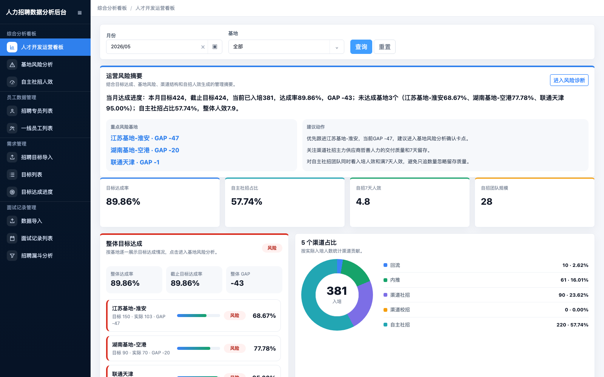
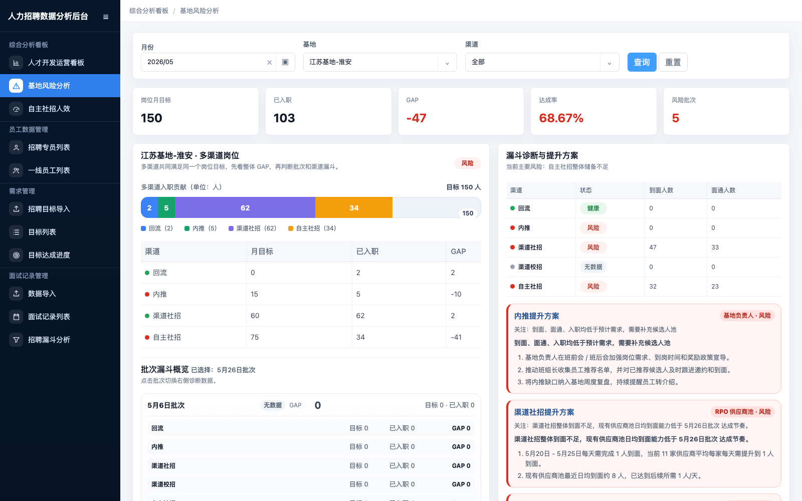
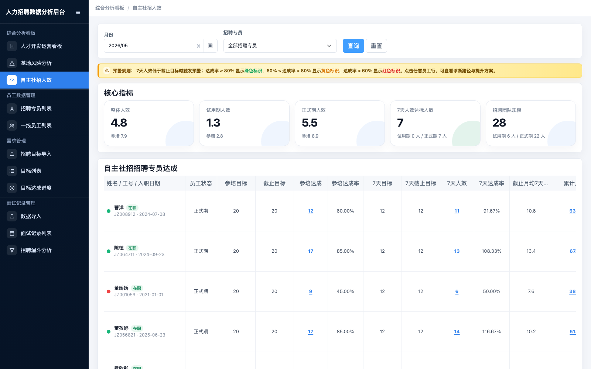
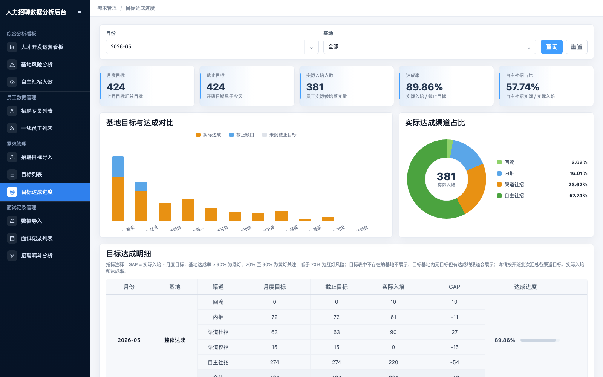

# 路演讲解逐字稿

## 使用说明

- 建议视频时长：`5-10 分钟`，本稿按约 `8 分钟` 设计。
- 录制方式：打开本地系统页面，按每个段落的“画面操作”切换页面，照读“逐字稿”。
- 已自动截图：截图已通过本地浏览器访问系统页面后生成，放在 `screenshots/` 目录，可用于剪辑封面、转场或提交材料。

## 截图素材

| 序号 | 页面 | 截图 |
| --- | --- | --- |
| 1 | 人才开发运营看板 | `screenshots/01-overview.png` |
| 2 | 基地风险分析 | `screenshots/02-base-risk.png` |
| 3 | 自主社招人效 | `screenshots/03-self-sourcing.png` |
| 4 | 目标达成进度 | `screenshots/04-target-progress.png` |

## 0. 开场

预计时长：`30 秒`

画面操作：

- 打开 `人才开发运营看板`。
- 停留在顶部核心指标区域。

逐字稿：

大家好，我这次参赛作品叫做“人力招聘数据分析后台”。

这个作品主要面向招聘负责人和人才开发团队，解决的是招聘数据分散、目标和实际无法快速对齐、风险基地定位慢、自主社招人效难追踪的问题。

一句话概括：它把原来依赖 Excel 手工汇总的招聘目标、员工入培、面试记录和自主人效，沉淀成一个可查询、可分析、可诊断的在线后台。

接下来我会用 5 到 10 分钟讲清楚四件事：我们解决了什么问题，收益有多大，系统是怎么做的，以及 AI 在这个过程中帮了什么忙。

## 1. 解决什么问题

预计时长：`1 分钟`

画面操作：

- 继续停留在 `人才开发运营看板`。
- 指向顶部的目标、实际、GAP、达成率、自招人效等核心指标。

逐字稿：

先说问题。

招聘管理里最核心的问题，是目标和实际之间能不能快速对齐。

过去这些数据分散在不同地方：目标在“人才开发目标拆解表”里，一线员工入培在员工组织表里，面试过程在面试记录里，自主社招人效又依赖招聘专员和渠道名称的匹配。

这些数据放在一起看时，会遇到几个很典型的问题。

第一，目标表的基地名称和员工组织表的基地名称不一致。比如目标表里叫 `10015升投`、`江苏基地-淮安`，组织表里可能是 `河北基地 > 10015升投 > 前台 > 培训期` 这样的多层级路径。如果直接按字段匹配，实际入培就会算不到目标上。

第二，部分渠道没有目标行，但是有实际入培。比如某个基地目标表没有 `回流` 目标，但员工实际里有 `回流` 人员。如果不补充这类实际-only 渠道，基地合计和整体达成都会偏低。

第三，风险定位慢。负责人打开看板后，不应该先自己从一堆基地里找谁最差，而应该直接看到风险最大的基地和风险渠道。

第四，自主社招人效容易算空或者口径不一致。它需要先识别人才开发部招聘专员，再把自主社招候选人按 `渠道名称` 归属到人，最后才能算参培人效和 7天人效。

所以这个作品的目标，就是把这些容易出错的人工口径，统一固化成系统能力。

## 2. 收益有多大

预计时长：`1 分钟`

画面操作：

- 在 `人才开发运营看板` 展示 `2026/05` 数据。
- 指向整体目标、实际、GAP、达成率和自招人效。

逐字稿：

再说收益。

从业务上看，它至少带来三类收益。

第一是节省手工汇总时间。原来要通过 Excel 对目标表、员工表、离职表、面试记录做多次透视和手工核对，现在进入看板后，可以直接看到整体目标、实际入培、GAP 和达成率。

以 2026 年 5 月为例，系统可以直接展示整体目标 `424`，当前库表验证的实际入培是 `381`，GAP 是 `-43`，达成率是 `89.86%`。

第二是减少口径错误。我们把一线员工对标目标、自主社招人效、实际-only 渠道补充这些规则都沉淀到了服务层，不再依赖每个人手工理解和手工复制公式。

第三是提升问题定位效率。比如进入基地风险分析时，系统会默认进入风险最大的基地，而不是停留在一个空泛的“全部”状态。负责人可以直接看到哪个基地缺口最大、哪个渠道风险最大、应该优先处理什么。

简单说，收益不是只做了一个页面，而是把“找数、对数、算数、定位问题”的过程自动化了。

## 3. 功能一：人才开发运营看板

预计时长：`1 分钟`

截图素材：

画面操作：

- 打开 `人才开发运营看板`。
- 选择月份 `2026/05`。
- 展示顶部核心指标和下方目标达成、自招人效区域。

逐字稿：

现在我们看第一个核心页面：人才开发运营看板。

这个页面是管理者的总览入口。

顶部展示的是最核心的经营指标：目标达成率、自主社招占比、自招 7天人效和自招团队规模。

下面是整体目标达成情况。系统会按基地列出目标、实际、GAP 和达成率，让负责人快速知道哪些基地已经达成，哪些基地仍有缺口。

这里还有一个口径统一点：综合看板和自主社招人效页都统一使用 `7天人效` 作为主指标，参培人效作为辅助指标。这样就避免了一个页面看 7天人效、另一个页面看参培人效，导致指标对不上的问题。

所以这个页面的作用，是让负责人先用一个页面掌握整体盘面，再决定要下钻到哪个模块。

## 4. 功能二：基地风险分析

预计时长：`1 分 20 秒`

截图素材：

画面操作：

- 打开 `基地风险分析`。
- 选择月份 `2026/05`。
- 不手动选择渠道，保持渠道为 `全部`。
- 展示默认进入 `江苏基地-淮安`，右侧展示风险渠道诊断。

逐字稿：

第二个核心页面是基地风险分析。

这个页面解决的是“风险优先定位”的问题。

我们做了一个关键体验：当用户进入页面后，系统会默认选择风险最大的基地。比如 2026 年 5 月，默认进入的是 `江苏基地-淮安`。

这里可以看到，这个基地月目标是 `150`，已入职是 `103`，GAP 是 `-47`，达成率是 `68.67%`。

注意顶部筛选区有一个细节：基地会自动对上风险最大的基地，但渠道仍然保持 `全部`。这样用户看到的是这个基地的完整多渠道情况，而不是一进来就把筛选条件锁死到某一个渠道。

同时，右侧的漏斗诊断区域会自动聚焦该基地内部风险最大的渠道和批次。也就是说，筛选层面看全部，诊断层面自动帮你找到最该看的问题。

这就是本页面的亮点：不是只告诉你“哪个基地差”，还进一步告诉你“这个基地里哪个渠道、哪个批次最需要处理”。

比如当系统判断自主社招或者渠道社招存在缺口时，会输出对应的漏斗诊断与提升方案，辅助负责人做下一步动作。

## 5. 功能三：自主社招人效

预计时长：`1 分 20 秒`

截图素材：

画面操作：

- 打开 `自主社招人效`。
- 选择月份 `2026/05`。
- 展示核心指标卡和招聘专员明细表。

逐字稿：

第三个重点是自主社招人效。

自招人效的难点在于，它不是简单数一下一线员工有多少人。

系统需要先识别招聘专员。这里我们通过组织路径包含 `人才开发部`，并且职位为 `招聘专员` 或 `初级招聘主管` 来识别招聘团队。

然后系统再看一线员工中 `招聘渠道 = 自主社招` 的人员，并通过 `渠道名称` 中 `+` 前面的姓名，把候选人归属到具体招聘专员。

这样就可以计算每个招聘专员的参培达成、满 7 天达成、参培人效和 7天人效。

以 2026 年 5 月为例，当前库表验证数据是：自招团队规模 `28`，自招参培人数 `220`，满 7 天人数 `125`，整体入培人效 `7.9`，整体 7天人效 `4.5`。

页面还会按试用期、正式期和整体做拆分。这样团队不仅知道自招整体表现，还能知道试用期招聘专员和正式期招聘专员分别处在什么水平。

下方明细表可以进一步下钻到招聘专员个人，帮助人才开发团队识别哪些人达标、哪些人存在持续低效或留存风险。

## 6. 功能四：目标达成进度

预计时长：`1 分`

截图素材：

画面操作：

- 打开 `目标达成进度`。
- 选择月份 `2026/05`。
- 展示整体达成和基地渠道明细。

逐字稿：

第四个页面是目标达成进度。

这里主要验证目标和实际是否真正对齐。

系统用目标表中的 `月份 + 基地 + 渠道` 作为目标口径，用一线员工列表中的入培时间、归一基地和招聘渠道作为实际口径。

一线员工的组织路径会先做归一，比如 `河北基地 > 10015升投 > 前台` 会归一到 `10015升投`，`江苏项目 > 10010项目 > 淮安热线交付部` 会归一到 `江苏基地-淮安`。

然后系统再按工号去重统计实际入培人数。

这里还有一个关键规则：如果某个目标基地下，有渠道没有目标行，但实际有人入培，比如 `回流`，系统会补一条 `月度目标 = 0` 的达成行，并把实际人数计入基地合计和整体合计。

这个规则很重要，因为它避免了因为目标表没有某个渠道行而漏算实际入培，确保整体达成率更接近线下真实口径。

## 7. 系统怎么做的

预计时长：`1 分`

画面操作：

- 可切回 `人才开发运营看板`，作为总结画面。

逐字稿：

接下来简单说一下系统是怎么做的。

技术上，这是一个 Node.js、Express、EJS 的单体 SSR 后台。它不是为了炫技做复杂架构，而是优先解决业务数据管理和分析效率。

数据链路是这样的：

第一步，导入或读取业务数据，包括目标表、组织表员工数据、面试记录。

第二步，服务层做标准化。这里包括组织路径归一、基地名称归一、渠道匹配、日期标准化、工号去重和敏感信息脱敏。

第三步，服务层计算指标。比如月度目标、截止目标、实际入培、GAP、达成率、自主社招人效、7天人效、风险基地和风险渠道。

第四步，页面只接收已经计算好的结果，负责展示、筛选和下钻。

这个设计的好处是：业务口径不散落在页面模板里，而是集中沉淀在服务层，后续规则变化时更容易维护和验证。

## 8. AI 帮了什么忙

预计时长：`1 分`

画面操作：

- 停留在任意看板页面。
- 如需要，可在视频中切换到文档目录，展示 `题目说明文档` 和 `测试验证说明`。

逐字稿：

最后说一下 AI 在这个作品里帮了什么忙。

第一，AI 帮助梳理需求和口径。比如一线员工如何对标目标表、自主社招人效怎么算、招聘专员规模怎么算、7天人效和参培人效怎么区分，这些规则都通过对话不断澄清，并最终沉淀到文档和代码里。

第二，AI 帮助定位数据偏差。我们在对比 5 月线下数据时，发现系统实际入培和线下表有差异。AI 通过查询库表、拆分基地和渠道、对比实际-only 渠道，定位到日期类型和渠道补行导致的漏算问题。

第三，AI 帮助修复代码并补测试。每个关键规则都补了对应测试，例如组织表一线员工要归一到目标基地、招聘专员要归一到人才开发部、实际-only 渠道要被计入合计。

第四，AI 帮助优化体验。比如基地风险页默认进入风险最大的基地、渠道筛选保持全部、综合看板和自招页统一展示 7天人效，以及页面切换缓存优化。

第五，AI 帮助生成提交材料。包括题目说明文档、测试验证说明、路演讲解逐字稿，以及功能截图素材。

所以 AI 在这里不是简单生成页面，而是参与了需求澄清、数据排查、代码实现、测试验证和材料沉淀的完整过程。

## 9. 收尾总结

预计时长：`30 秒`

画面操作：

- 回到 `人才开发运营看板` 顶部。

逐字稿：

最后总结一下。

这个作品解决的是招聘经营管理中的真实问题：数据分散、口径不一致、风险定位慢、人效难追踪。

通过这套后台，招聘负责人和人才开发团队可以在线查看目标达成、定位风险基地、分析渠道缺口、追踪自主社招人效，并通过统一口径减少人工做表和反复对数。

它的价值不只是做了几个看板，而是把招聘目标达成、基地风险和自招人效这些关键管理动作，沉淀成了可复用、可验证、可持续迭代的数据产品能力。

我的讲解到这里，谢谢大家。

## 10. 录制检查清单

- [ ] 视频时长控制在 `5-10 分钟`。
- [ ] 开头说明作品名称和目标用户。
- [ ] 讲清楚解决的问题：数据分散、口径不一致、风险定位慢、自招人效难追踪。
- [ ] 讲清楚收益：减少手工汇总、减少口径错误、提高风险定位效率。
- [ ] 展示人才开发运营看板。
- [ ] 展示基地风险分析默认进入风险最大基地。
- [ ] 展示自主社招人效。
- [ ] 展示目标达成进度。
- [ ] 讲清楚 AI 帮助了需求梳理、数据排查、代码实现、测试验证和材料沉淀。
- [ ] 结尾回到作品价值总结。
